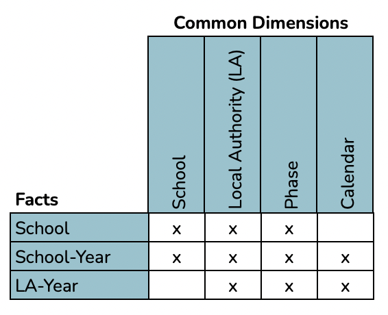

```{r setup, include=FALSE}
# Load knitr package
library(knitr)

# Knitr Options
opts_chunk$set(
	echo = TRUE,
	message = FALSE,
	warning = FALSE,
	fig.align = 'center'
)
```

# Introduction
This notebook serves as the documented code to read and prepare data for the England School Admissions Dashboard project ([github](https://github.com/clarelgibson/england-school-admissions) | [tableau](https://public.tableau.com/views/Schools_16505251102060/Home?:language=en-GB&:display_count=n&:origin=viz_share_link)).

The notebook begins by reading in the source data required for the dashboards. It then works through the data wrangling steps necessary to clean and prepare the data for transfer to Tableau.

## Source data
The full list of data sources, download links and retrieval steps can be found in the [project wiki](https://github.com/clarelgibson/england-school-admissions/wiki/Source-data).

## Required packages
```{r packages}
# Packages
library(tidyverse)      # for general wrangling
library(data.table)     # for transposing data frames
library(janitor)        # for cleaning column headers
library(lubridate)      # for working with dates
```

## Custom functions
I have created several custom functions to assist with data prep. Load these functions by sourcing the `utils.R` script in the working directory.
```{r custom-functions}
# Custom functions
source("utils.R")
```

# Read data
## Info
This file contains descriptive fields relating to primary and secondary schools across all local authorities in England. It excludes nurseries, special schools, children's centers, pupil referral units and post-16 education. We can consider this largely to be the dimensional data for the dashboard, while the other datasets for Offers and Performance can be considered to be the measures.

The source data is stored in a CSV file on [Google Drive](https://drive.google.com/drive/u/1/folders/1lFZhobbGoCKKEtaZ5CDiphTbOxcbvJzW). We can read the CSV file directly from the source location using the custom function `read_csv_gdrive()`. When reading in source data, I usually assign it to a variable with the prefix `src_` to indicate that this is source data. Once I start to modify the data, I remove the prefix. That way, I always have a copy of the original source data in its unaltered form to refer back to.

```{r info-read}
# Read in the source data for info
src_info_path <- "https://drive.google.com/file/d/1kUqKvphHnh4M-NfP4gXLAr9MxdxoWgMT/view?usp=sharing"
src_info <- read_csv_gdrive(src_info_path)
```

```{r info-glimpse}
# List the columns and data types in the data frame
glimpse(src_info)
```

This data frame has `r nrow(src_info)` rows and `r ncol(src_info)` columns. The columns are a mix of character, numeric and logical^[Columns which have been detected as logical, or boolean, always raise a small red flag for me. It can be an indicator that the column is empty of data (i.e. all values are `NA`). In this case, it looks like this is indeed what has happened, since running the `unique()` function over any of these columns always returns just a single value of `NA`. Therefore, I can safely exclude these columns from my analysis since they contain no useful data.] data types. The columns include some identifiers for time, geography and school, some descriptive dimensions about each school and some measures relating to the number of pupils of different types. Each row represents a single school and the data represents the latest available.

## Offers
This file contains data relating to the number of offers made to applicants for secondary and primary school places since 2014, and the proportion which received preferred offers. Data is aggregated at the school level. Further details including an explanation of the terminology used in this dataset can be found [here](https://drive.google.com/drive/u/1/folders/1bbnbd9d4HDn3yXIIhaRSigZV46KpCyKy). Once again, we can connect to it through Google Drive.

```{r offers-read}
# Read in the source data for offers
src_offers_path <- "https://drive.google.com/file/d/1bG0a0WRg-LEnASl6M3J0qyHJA_cMY1CQ/view?usp=sharing"
src_offers <- read_csv_gdrive(src_offers_path)
```

```{r offers-glimpse}
# List the columns and data types in the data frame
glimpse(src_offers)
```

From the code outputs above, we can see that this data frame has `r nrow(src_offers)` rows and `r ncol(src_offers)` columns (a mix of character and numeric data types). The columns include some identifiers for time, geography and school, some descriptive dimensions for the number of preferences and type of school and some measures relating to the number of applications and offers made. Each row represents a single school for a single academic year.

## Performance
These files contain key stage 2 (KS2) performance data for primary schools and key stage 4 (KS4) performance data for secondary schools in England for academic years from 2014 onwards. Note that due to the COVID-19 pandemic, the UK Government cancelled all statutory national curriculum assessments due to be held in summer 2020 and 2021 at all Key Stages. Therefore, no data is available for the 2019/20 or 2020/21 academic years. Further details including an explanation of the terminology used in this dataset can be found [here](https://drive.google.com/drive/folders/1vai66CUaYhPI0RXQI-BlC5kufZZyf3JU?usp=sharing).

The source data for performance is stored in several CSV files on the Google Drive. Having read through the guidance notes for these files, for the measures I want to compare, I can find these in all years from 2015/16 onwards.

```{r performance-read, message=FALSE}
# Read in the performance data files from 2015/16 onwards
# 2015-16 KS2
src_perf_1516ks2_path <- "https://drive.google.com/file/d/1migtFWfMUr8HJDeujfw6h7p2nNDVsbp4/view?usp=sharing"
src_perf_1516ks2 <- read_csv_gdrive(src_perf_1516ks2_path)

# 2015-16 KS4
src_perf_1516ks4_path <- "https://drive.google.com/file/d/1ijl88VsaaNdEC-N2O9hcRKc2sixcMyES/view?usp=sharing"
src_perf_1516ks4 <- read_csv_gdrive(src_perf_1516ks4_path)

# 2016-17 KS2
src_perf_1617ks2_path <- "https://drive.google.com/file/d/1B1LpH8RXlBoH7C9mJPL4FribTvIUzekq/view?usp=sharing"
src_perf_1617ks2 <- read_csv_gdrive(src_perf_1617ks2_path)

# 2016-17 KS4
src_perf_1617ks4_path <- "https://drive.google.com/file/d/1jOOmuKXDDp--cbESCz-j4Vp7ufVK3tPV/view?usp=sharing"
src_perf_1617ks4 <- read_csv_gdrive(src_perf_1617ks4_path)

# 2017-18 KS2
src_perf_1718ks2_path <- "https://drive.google.com/file/d/1zJxcJrsOr7nvWwb6Yyg48QoMgSp76e8V/view?usp=sharing"
src_perf_1718ks2 <- read_csv_gdrive(src_perf_1718ks2_path)

# 2017-18 KS4
src_perf_1718ks4_path <- "https://drive.google.com/file/d/1-5WDJ5dZulWmqQa8fX5eczA0Bo2m_jEc/view?usp=sharing"
src_perf_1718ks4 <- read_csv_gdrive(src_perf_1718ks4_path)

# 2018-19 KS2
src_perf_1819ks2_path <- "https://drive.google.com/file/d/1CmXvDtDOmIlXXUzZ9SPW4Yoti-rTzi75/view?usp=sharing"
src_perf_1819ks2 <- read_csv_gdrive(src_perf_1819ks2_path)

# 2018-19 KS4
src_perf_1819ks4_path <- "https://drive.google.com/file/d/1uBhU0yeuV97d66PRR60pq8UaRWvdGIaA/view?usp=sharing"
src_perf_1819ks4 <- read_csv_gdrive(src_perf_1819ks4_path)
```

These files contain a large number of columns. We will need to pick out only the most relevant for reporting, which can be standardised across all schools.

## Intake
This dataset includes details about the year groups that schools are divided into in England. The data is aggregated by year group.

```{r intake-read}
# Read in the source data for intake
src_intake_path <- "https://drive.google.com/file/d/1ASiYEbIbXg7VVNnkz3N1Cg1lHNqDxMiQ/view?usp=sharing"
src_intake <- read_csv_gdrive(src_intake_path)
```

```{r intake-glimpse}
# List the columns and data types in the data frame
glimpse(src_intake)
```

This dataset has `r nrow(src_intake)` rows and `r ncol(src_intake)` columns and contains largely descriptive information about the academic year groups in England.

## Calendar
This dataset includes details about the academic years covered by the data.

```{r calendar-read}
# Read in the source data for calendar
src_calendar_path <- "https://drive.google.com/file/d/1el2cL02nQidzN1pMcZ7AUb3h6wXuzN_E/view?usp=sharing"
src_calendar <- read_csv_gdrive(src_calendar_path)
```

```{r calendar-glimpse}
# List the columns and data types in the data frame
glimpse(src_calendar)
```

This will be our date table. Since the lowest unit of time in the data is year, this is the level of detail of the calendar table. This table has `r nrow(src_calendar)` rows and `r ncol(src_calendar)` columns.

# Clean data
## Info
One key piece of cleaning we need to do with this dataset is to provide a mechanism to group entities that describe the same establishment (i.e. where there has been a change in URN over time due to conversion to academy). We can do this using the `links` columns at the end of this data frame, along with the `urn`, to create a bridge table, which we'll call `brg_school`.

```{r bridge-school-unfiltered}
# Set up the bridge table
brg_school_unfiltered <- src_info %>%
  # select required columns
  select(master_urn = urn,
         status = establishment_status_name,
         starts_with("link_")) %>% 
  # pivot the links
  pivot_longer(!c(master_urn, status),
               values_drop_na = TRUE) %>% 
  # drop the name column
  select(-name) %>% 
  # split the description column into useful data
  mutate(linked_urn = as.numeric(str_extract(value,"\\d+")),
         link_type = str_trim(str_extract(value,"\\D+"))) %>% 
  # drop the value column
  select(-value)
```

At this point, we can stop and check what are the unique values of the `link_type` column?

```{r bridge-link-types}
# What are the unique values of link_type
unique(brg_school_unfiltered$link_type)
```

The links I am interested in are the predecessor-successor links so that I can keep schools grouped over time. I want the successor school to be retained as the master school and all predecessors to be linked to the master. If a school has no links then we simply list the master and linked URNs as the same number. Therefore, I need to keep all of the open schools as the master list and any predecessors need to be linked to those master URNs.

```{r bridge-school}
# Filter the table
brg_school <- brg_school_unfiltered %>% 
  # add self-urn
  mutate(self_urn = master_urn) %>% 
  pivot_longer(cols = c(linked_urn, self_urn),
               names_to = "urn_type",
               values_to = "linked_urn",
               values_drop_na = TRUE) %>% 
  # keep only currently open schools
  filter(grepl("^Open.*",
               status,
               ignore.case = TRUE)) %>% 
  # select required columns
  select(master_urn,
         linked_urn)
```

Now that the bridge table is set up I can filter the `src_info` table to include only the currently open schools. The number of distinct URNs in this table should then match the number of distinct master URNs in `brg_school`.

```{r info-filter}
# Keep only the currently open schools in info
info <- src_info %>% 
  filter(grepl("^Open.*",
               establishment_status_name))
```

```{r info-urn-count-check}
# Check if the number of distinct URNs in info matches the number of
# distinct master URNs in brg_school
n_distinct(info$urn) == n_distinct(brg_school$master_urn)
```

The numbers match. Success!

Next, let's keep only the columns we need from `src_info`.

```{r info-select-cols}
# Keep only the required columns from src_info
info <- info %>% 
  select(urn:establishment_status_name,
         open_date,
         close_date,
         phase_of_education_name:statutory_high_age,
         gender_name,
         religious_character_name,
         admissions_policy_name,
         school_capacity,
         number_of_pupils:percentage_fsm,
         ofsted_last_insp:head_preferred_job_title,
         gor_name:lsoa_name,
         ofsted_rating_name,
         msoa_code:fsm)
```

Let's now review the selected column headings in this dataset and the number of unique values in each column

```{r info-unique-values}
# Print a list of the column headings in the info df
info %>% 
  summarise_all(n_distinct) %>% 
  transpose(keep.names = "field") %>% 
  rename(unique_values = V1)
```

Some columns have relatively few unique values, making these columns clearly categorical. I'd like to review the values to ensure they are consistent and well labelled.

```{r info-review-establishment-type}
# Review the unique values in establishment type
unique(info$type_of_establishment_name)
```

These values all look ok. [This page](https://www.leicester.gov.uk/schools-and-learning/school-and-colleges/school-admissions/understanding-the-different-types-of-school/) has some useful definitions of the different types of school.

```{r info-review-establishment-group}
# Review the unique values in establishment group
unique(info$establishment_type_group_name)
```

All ok.

```{r info-review-status}
# Review the unique values in establishment status
unique(info$establishment_status_name)
```

All ok.

```{r info-review-phase}
# Review the unique values in phase of education
unique(info$phase_of_education_name)
```

All ok.

```{r info-review-gender}
# Review the unique values in gender
unique(info$gender_name)
```

Some missing values here. Let's replace those with 'Not reported'.

```{r info-recode-gender}
# Convert missing values in gender
info$gender_name[is.na(info$gender_name)] <- "Not reported"

# Check the results
unique(info$gender_name)
```

All ok.

```{r info-review-religious-character}
# Review the unique values in religious character
unique(info$religious_character_name)
```

Again, let's fix the missing values.

```{r info-recode-religious-character}
# Convert missing values in religious character
info$religious_character_name[is.na(info$religious_character_name)] <- 
  "Not reported"

# Check the results
unique(info$religious_character_name)
```

All ok.

```{r info-review-admissions-policy}
# Review the unique values in admissions policy
unique(info$admissions_policy_name)
```

Again let's fix the missing values.

```{r info-recode-admissions-policy}
# Convert missing values in admissions policy
info$admissions_policy_name[is.na(info$admissions_policy_name)] <- 
  "Not reported"

# Check the results
unique(info$admissions_policy_name)
```

All ok.

```{r info-review-ofsted}
# Review the unique values in ofsted rating
unique(info$ofsted_rating_name)
```

Some recoding is necessary here. According to [Ofsted](https://www.gov.uk/government/publications/education-inspection-framework/education-inspection-framework), school inspections use a 4-point grading scale:

* grade 1 - outstanding
* grade 2 - good
* grade 3 - requires improvement
* grade 4 - inadequate

In our dataset, I see some other values of `Serious Weaknesses` and `Special Measures`, which are not on the ratings list provided by Ofsted. In fact, both of these ratings are a [subset](https://www.gov.uk/government/publications/school-inspections-a-guide-for-parents/school-inspections-a-guide-for-parents) of the "inadequate" (grade 4) rating. Therefore, I can recode both of these values as `inadequate`. I can also add in the grade points to the ratings dimension table to provide a quantitative and aggregatable measure.

```{r info-recode-ofsted}
# Fix values for ofsted rating
info <- info %>% 
    mutate(ofsted_rating_name = case_when(
      grepl("Weakness", ofsted_rating_name) ~ "Inadequate",
      grepl("Measures", ofsted_rating_name) ~ "Inadequate",
      is.na(ofsted_rating_name) ~ "Not reported",
      TRUE ~ ofsted_rating_name
    ),
    ofsted_rating_score = case_when(
    grepl("Outstanding", ofsted_rating_name) ~ 1,
    grepl("Good", ofsted_rating_name) ~ 2,
    grepl("improvement", ofsted_rating_name) ~ 3,
    grepl("Inadequate", ofsted_rating_name) ~ 4
  ))

# Check results
unique(info$ofsted_rating_name)
unique(info$ofsted_rating_score)
```

## Offers
Let's keep only the columns we need from `src_offers`. Some of the columns are duplicates of columns already in the `info` table, and some are just not required.

```{r offers-select-cols}
# Select required columns from offers
offers <- src_offers %>% 
  select(time_period,
         region_code,
         region_name,
         old_la_code,
         school_laestab_as_used,
         la_name,
         number_preferences_la,
         total_number_places_offered:offers_to_applicants_from_another_la,
         denomination,
         school_urn,
         entry_year)
```

Next we can filter out any records where the `school_urn` is `n/a`.

```{r offers-filter}
# Remove entries with null URN
offers <- offers %>% 
  filter(school_urn != "n/a")
```

Let's now review the selected column headings in this dataset and the number of unique values in each column

```{r offers-unique-values}
# Print a list of the column headings in the offers df
offers %>% 
  summarise_all(n_distinct) %>% 
  transpose(keep.names = "field") %>% 
  rename(unique_values = V1)
```

Let's review the categorical values to ensure they are consistent and well labelled.

```{r offers-review-denomination}
# Review the unique values in denomination
unique(offers$denomination)
```

There are some values of `n/a` here. Let's see what those are.

```{r offers-denomination-na}
# Review the n/a values in denomination
offers %>% 
  filter(denomination == "n/a") %>% 
  head()
```

I guess this must be for schools who did not report their denomination. Let's replace `n/a` with `Not reported`.

```{r offers-denomination-replace-na}
# Replace n/a
offers$denomination[offers$denomination == "n/a"] <- "Not reported"

# Check the results
unique(offers$denomination)
```

All ok.

```{r offers-review-entry-year}
# Review the unique values in entry year
unique(offers$entry_year)
```

All ok.

## Performance
From this dataset we really need to select one or two good measures of performance for KS2 and KS4, along with the URN so that we can join back to school.

* For KS2 we'll used the progress measures `readprog`, `writprog` and `matprog`. [This article](https://www.theschoolrun.com/understanding-primary-school-league-tables) has a good explanation of the KS2 progress scores, and [this article](https://assets.publishing.service.gov.uk/government/uploads/system/uploads/attachment_data/file/851788/KS2_progress_banding_calculations_bandings_2019.pdf) explains how the bandings can be calculated.
* For KS4 we'll use the progress 8 and attainment 8 measures `p8mea` and `att8scr`. [This article](https://www.goodschoolsguide.co.uk/curricula-and-exams/progress-8-attainment-8) has a good explanation of these measures.

We will further need to filter both the KS2 and KS4 data to include only rows that are aggregated at the mainstream school level (`RECTYPE = 1`).

```{r perf-ks2-clean}
# Clean the KS2 data
# Bind rows from all years
perf_ks2 <- bind_rows(
  "2015" = src_perf_1516ks2,
  "2016" = src_perf_1617ks2,
  "2017" = src_perf_1718ks2,
  "2018" = src_perf_1819ks2,
  .id = "year"
) %>% 
  # Filter to rectype == 1
  filter(rectype == 1) %>% 
  # Select the required columns
  select(year,
         urn,
         readprog,
         writprog,
         matprog) %>% 
  # convert to numeric (any strings can be converted to NA)
  mutate(across(everything(), as.numeric))

# View the head
head(perf_ks2)
```

```{r perf-ks4-clean}
# Bind rows from all years
perf_ks4 <- bind_rows(
  "2015" = select(src_perf_1516ks4, rectype, urn, p8mea, att8scr),
  "2016" = select(src_perf_1617ks4, rectype, urn, p8mea, att8scr),
  "2017" = select(src_perf_1718ks4, rectype, urn, p8mea, att8scr),
  "2018" = select(src_perf_1819ks4, rectype, urn, p8mea, att8scr),
  .id = "year"
) %>% 
  # Filter to rectype == 1
  filter(rectype == 1) %>% 
  # Select the required columns
  select(year,
         urn,
         p8mea,
         att8scr) %>% 
  # convert to numeric (any strings can be converted to NA)
  mutate(across(everything(), as.numeric))

# View the head
head(perf_ks4)
```

Now we can join the KS2 and KS4 data together and recode the progress measure names.

```{r performance-combined}
# Combine two data frames
performance <- perf_ks2 %>% 
  full_join(perf_ks4)

# View the head
head(performance)
```

## Intake
No cleaning required. We can simply rename without the `src_` prefix.

```{r intake-clean}
# Rename the variable
intake <- src_intake
```

## Calendar
No cleaning required. We can simply rename without the `src_` prefix.

```{r calendar-clean}
# Rename the variable
calendar <- src_calendar
```

# Model data
The matrix below shows the fact and dimension tables that I intend to create for this model and the relationships between them.


To build out the dimensional model for this data, we need to review all of the columns we intend to use, so that we can determine where they fit in the model. The custom function `describe_df()` contained in the `utils.R` file can help us with this.
```{r describe-df}
# Create a vector of dfs to describe
data <- list("info" = info,
             "offers" = offers,
             "performance" = performance)

# Run describe_df() over each df
t_data <- lapply(data, describe_df)

# Bind each df into a single df
t_data <- bind_rows(t_data, .id = "source_table")
```

After exporting the new `t_data` dataframe to a spreadsheet, I created a file named [star-schema](ref/star-schema.csv) which maps the raw source data to the corresponding dimension and fact tables for the star schema model.
```{r read-star-schema-planning}
# Read in star schema planning document
star_schema_path <- "https://drive.google.com/file/d/1wyopZkDzEQzPVMUrZBoiMNMGSdWxyk0i/view?usp=sharing"
star_schema <- read_csv_gdrive(star_schema_path)
```

## Dimensions
### Local Authority

The following columns are required for the local authority dimension table:
```{r dim-la-cols}
# Which columns are needed for the local authority dimension?
star_schema %>% 
  filter(model_table == "dim_la") %>% 
  kable(caption = "Columns required for the local authority dimension")
```

These columns can all come from the `offers` data frame.

```{r dim-la-build}
# Build out the local authority dimension table
dim_la <- offers %>% 
  select(la_code = old_la_code,
         la_name,
         region_code,
         region_name) %>% 
  distinct()

# Check the result
head(dim_la)
```

Note that `la_code` is not unique.

```{r dim-la-la-code}
# How many values of la_code are not unique?
dim_la %>% 
  count(la_code) %>% 
  filter(n > 1)
```

Let's check if `la_name` is unique.

```{r dim-la-la-name}
# Is LA name unique?
dim_la %>% 
  count(la_name) %>% 
  filter(n > 1)
```

This means that, over time, some codes have been recycled and used for different local authorities, and some local authorities have had changes in code. Let's assign a unique key to each record, and add a record for the `null` case, which we'll call `Not reported`.

```{r dim-la-key}
# Specify the null value
dim_la_null <- tibble(la_key = 0,
                      la_code = 0,
                      la_name = "Not reported",
                      region_code = "Not reported",
                      region_name = "Not reported")

# Assign a key and row for null values
dim_la <- dim_la %>% 
  rowid_to_column(var = "la_key") %>% 
  bind_rows(dim_la_null) %>% 
  arrange(la_key)
```

### School
The following fields are required for the school dimension.

```{r dim-school-cols}
# Which columns are needed for the school dimension?
star_schema %>% 
  filter(model_table == "dim_school") %>% 
  kable(caption = "Columns required for the school dimension")
```

These columns can all be found in the `info` table. We need to ensure that we include only the URNs in the `master_urn` column of our bridge table.

```{r dim-school-build}
# Build out the school dimension table
dim_school <- brg_school %>% 
  select(urn = master_urn) %>% 
  left_join(select(info,
                   urn,
                   establishment_number,
                   establishment_name,
                   establishment_type = type_of_establishment_name,
                   establishment_group = establishment_type_group_name,
                   status = establishment_status_name,
                   open_date,
                   close_date,
                   education_phase = phase_of_education_name))
```

